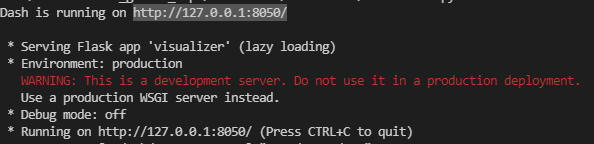
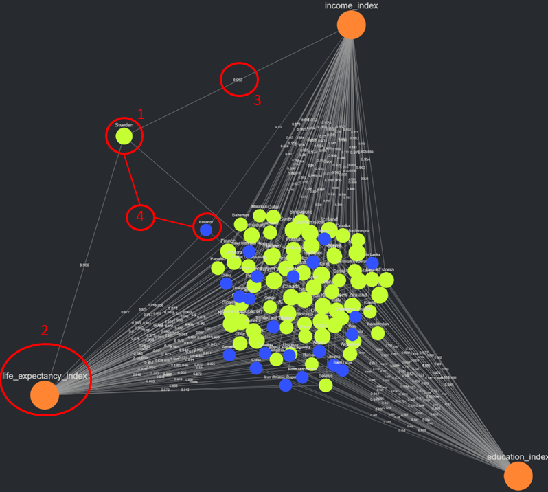

# Combined Scores Visualizer

This software is designed to visualize data, specifically combined scores data, utilizing graph theory and network analysis concepts. It was initially an offshoot of SemNet [cite SemNet], where interpreting results (especially multi-target results) all but require such a tool. Given the nature of the SemNet results data, the visualizer was generalized to allow similar data sets to be used.

### Recomended Installation
1. Create and activate a custom virtual environment using the venv module. 
    * Documentation: https://docs.python.org/3/library/venv.html
    * Additional resource: https://python.land/virtual-environments/virtualenv
2. Once the virtual environment is activated, use pip to install all necessary packages. Use the command `pip install path/to/visualizer/directory`, where the directory being pointed to contains `setup.py`. Make sure the virtual environment is activated! 
    * Pip documentation: https://pypi.org/project/pip/
    * Potentially useful Stack thread: https://stackoverflow.com/questions/41535915/python-pip-install-from-local-dir
3. Simply run `visualizer.py` and voilà! It should be running on `localhost`, using whatever port/host indicated in the output. 
    

### Definitions
* **Combined score**: an aggregated score across multiple performance metrics. Take the Human Development Index (HDI) as an example. The HDI value assigned to a country is the geometric mean of three performance metrics: life expectancy, expected years of schooling/mean years of schooling, and gross national income per captia, all normalized between 0 and 1. The HDI value in this case is the combined score of the three performance metrics mentioned. This combined score is then used to rank countries based on how "developed" they are.
* **Source node**: A node that has an in-degree of zero. This term is borrowed from graph theory, and it is used to model the individual datapoints that are being visualized. Each source node represents a different entity, in this case a specific datapoint. Continuing the HDI example, both Norway and Malawi, countries ranked based on their respective HDI, would each be represente in the visualizer as a node. This node is defined as the source node.

* **Target node**: A node that has an out-degree of zero. This is another term borrowed from graph theory, and it is used to model the metrics being combined to form the combined score. In the HDI example, the target nodes would be life expectancy, expected years of schooling/mean years of schooling, and gross national income per captia respectively. In this example, each source node, representing each country, is assigned a value in respect to each target node. Not EVERY source node must be ranked in respect to EVERY target node.

* **Edge value**: The value assigned to each connection between a source and target node. In the HDI example, Norway is assigned a value in respect to all three target nodes. This relationship could be described as "Norway scores X in respect to life expectancy" or "Malawi scores Y in respect to gross national income per capita. In these example relationships, the X and Y values represent the edge values. These edge values are combined, per source node, to generate a combined score (which is then assigned to that source node).

* **Node Type**: A discrete categorization that can be assigned to both source and target nodes. For example, the source node "Norway" in the HDI example might be assigned the type "Europe" to indicate what continent the country resides. The target node "life expectancy" might be assigned the type "target_node" to indicate that it's a target. 

1. Source node
2. Target node
3. Edge value
4. Node type (color differences represent HDI bracket)